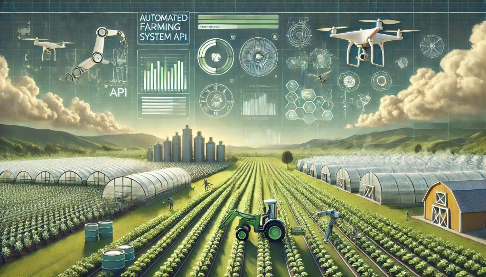

# Automated Farming System API - afs_fastapi



## Project Outline

### 1. Project Purpose

This project aims to harness Machine Learning (ML) and robotics to automate essential farming processes, including
operating farm equipment, maintaining soil health, and managing water quality. By integrating data-driven insights with
advanced automation, the project seeks to enhance farming efficiency, sustainability, and productivity.

The system provides a robust set of API interfaces, using [FastAPI](https://fastapi.tiangolo.com), to support diverse
use cases, ranging from controlling robotic devices and physical farm equipment to monitoring environmental factors such
as soil, water, and air quality. The APIs are designed to serve a wide range of consumers, including AI agents managing
autonomous operations and humans overseeing the overall system or specific subsystems.

---

### 2. Locating Operational Manuals for Farm Equipment

**Objective:** Identify and utilize online resources that provide operational manuals for farm equipment. These manuals
will guide the adaptation of current robotics to operate agricultural machines for automation purposes.

**FarmTractor Model:**
The `FarmTractor` model is a Pydantic model used in the project to represent a farm tractor. It includes fields such as
`make`, `model`, `year`, and `manual_url` to store the URL of the operational manual for the tractor. This model is used
to demonstrate the use of Pydantic models in FastAPI and to provide a structured way to manage tractor data within the
system.

**Attributes:**

- `make` (str): The make of the tractor.
- `model` (str): The model of the tractor.
- `year` (int): The year of manufacture.
- `manual_url` (str | None): URL to the manual.

**Methods:**

The `FarmTractor` class provides several methods to interact with and control the tractor.
Below is a list of the available methods:

- `start_engine()` -> str: Starts the engine of the tractor.
- `stop_engine()` -> str: Stops the engine of the tractor.
- `change_gear(gear: str)` -> str: Changes the gear of the tractor.
- `accelerate(increment: int)` -> str: Accelerates the tractor.
- `brake(decrement: int)` -> str: Brakes the tractor.
- `engage_power_takeoff()` -> str: Engages the power takeoff.
- `disengage_power_takeoff()` -> str: Disengages the power takeoff.
- `activate_hydraulics()` -> str: Activates the hydraulics.
- `deactivate_hydraulics()` -> str: Deactivates the hydraulics.
- `__str__()` -> str: Returns the string representation of the tractor.

**Example Usage:**

```python
from afs_fastapi.equipment.farm_tractors import FarmTractor

# Example usage:
tractor = FarmTractor(make="John Deere", model="9RX", year=2023, manual_url="https://example.com/manual")
print(f"Make: {tractor.make}, Model: {tractor.model}, Year: {tractor.year}, Manual URL: {tractor.manual_url}")
```

**Build Process:**

To build the project, follow these steps:

1. Clone the repository: `git clone https://github.com/dderyldowney/afs_fastapi.git`
2. Change to the project directory: `cd afs_fastapi`
3. Create a virtual environment: `python -m venv .venv`
4. Activate the virtual environment: `source .venv/bin/activate`
5. Install the project dependencies: `pip install -r requirements.txt`
6. Install build tools: `pip install build`
7. Build the project: `python -m build`
8. Install the generated wheel file: `pip install dist/afs_fastapi-0.1.0-py3-none-any.whl`
9. Run the FastAPI application: `uvicorn afs_fastapi.main:app --reload`

**Sources:**

1. [AgManuals](https://agmanuals.com)
2. [Case IH Operator Manuals](https://www.caseih.com/en-us/unitedstates/service-support/operators-manuals)
3. [Farm Manuals Fast](https://farmmanualsfast.com)
4. [AGCO Technical Publications](https://www.agcopubs.com)
5. [John Deere Manuals and Training](https://www.deere.com/en/parts-and-service/manuals-and-training)
6. [Farming and Construction Manuals](https://farming-constructionmanuals.com)
7. [Solano Horizonte](https://solano-horizonte.com/download-catalogs-and-manuals-of-agricultural-machinery)
8. [Yesterday's Tractors Forums](https://forums.yesterdaystractors.com)
9. [Tractor Tools Direct](https://tractortoolsdirect.com/manuals)
10. [General Implement Distributors](https://www.generalimp.com/manuals)
11. [TractorData](https://www.tractordata.com)
12. [Tractor Manuals Downunder](https://www.tractor-manuals-downunder.com)

---

### 3. Monitoring and Maintaining Soil Conditions

**Objective:** Research and utilize tools, sensors, and platforms to monitor soil composition, mineral content, and pH
balance, ensuring optimal crop health.

**Resources:**

1. [Soil Scout](https://soilscout.com)
2. [Renke 4-in-1 Soil Nutrient Sensor](https://www.renkeer.com/product/soil-nutrient-sensor/)
3. [Murata Soil Sensors](https://www.murata.com/en-us/products/sensor/soil)
4. [HORIBA LAQUAtwin pH Meters](https://www.horiba.com/usa/water-quality/applications/agriculture-crop-science/soil-ph-and-nutrient-availability/)
5. [Sensoterra Soil Moisture Sensors](https://www.sensoterra.com/soil-sensor-for-agriculture/)
6. [DFRobot 4-in-1 Soil Sensor](https://www.dfrobot.com/product-2830.html)
7. [EarthScout Agricultural Field Sensors](https://www.earthscout.com/)
8. [University of Minnesota Extension: Soil Moisture Sensors](https://extension.umn.edu/irrigation/soil-moisture-sensors-irrigation-scheduling)
9. [ATTRA: Soil Moisture Monitoring Tools](https://attra.ncat.org/publication/soil-moisture-monitoring-low-cost-tools-and-methods/)
10. [ESCATEC Electrochemical Sensors](https://www.escatec.com/blog/electrochemical-sensors-soil-analysis-through-precision-agriculture)

---

### 4. Monitoring and Maintaining Water Conditions

**Objective:** Identify and deploy tools to assess and maintain water composition, mineral levels, and pH balance,
ensuring water quality is optimized for agricultural use.

**Resources:**

1. [Renke Water Quality Sensors](https://www.renkeer.com/top-7-water-quality-sensors/)
2. [In-Situ Agriculture Water Monitoring](https://in-situ.com/us/agriculture)
3. [Xylem Analytics Water Quality Monitoring](https://www.xylemanalytics.com/en/products/water-quality-monitoring)
4. [KETOS Automated Water Monitoring](https://ketos.co/)
5. [YSI Water Quality Systems](https://www.ysi.com/products)
6. [SGS Agricultural Water Testing](https://www.sgs.com/en-us/services/agricultural-water-testing)
7. [Boqu Instrument Water Quality Sensors](https://www.boquinstrument.com/how-water-quality-sensors-are-used-in-agriculture-and-farming.html)
8. [Digital Matter Remote Sensor Solutions](https://sense.digitalmatter.com/blog/water-quality-monitoring)
9. [Intuz IoT Water Monitoring](https://www.intuz.com/blog/iot-for-water-monitoring-in-crops)
10. [Rika Sensor Water Quality Sensors](https://www.rikasensor.com/blog-top-10-water-quality-sensors-for-water-treatments.html)

---

### 5. Utilizing Publicly Available Water Sampling Datasets

**Objective:** Access and analyze publicly available water quality datasets to inform ML models for monitoring water
conditions suitable for farming.

**Sources:**

1. [Water Quality Portal (WQP)](https://www.waterqualitydata.us/)
2. [USGS National Water Information System (NWIS)](https://catalog.data.gov/dataset)
3. [EPA Water Quality Data](https://www.epa.gov/waterdata/water-quality-data)
4. [Kaggle: Water Quality Dataset for Crop](https://www.kaggle.com/datasets/abhishekkhanna004/water-quality-dataset-for-crop)
5. [Ag Data Commons: Soil and Water Hub Modeling](https://agdatacommons.nal.usda.gov/articles/dataset/Soil_and_Water_Hub_Modeling_Datasets/24852681)
6. [NASA Earthdata: Water Quality](https://www.earthdata.nasa.gov/topics/ocean/water-quality)

---

### 6. Project Integration and Machine Learning Goals

**Objective:** Synthesize the research and datasets into ML models and robotics systems capable of automating farm
operations, improving efficiency, and ensuring sustainability. Models will address:

- Autonomous machine operation (leveraging operational manuals).
- Soil condition predictions and adjustments.
- Water quality monitoring and real-time management.

**Tools and Techniques:**

- ML libraries like TensorFlow and PyTorch.
- IoT-enabled sensors for real-time data collection.
- Integration with cloud platforms for data storage and analysis.

---

### Conclusion

This project will employ cutting-edge ML and robotics solutions to automate farming processes, ensuring optimized
resource utilization and sustainable agricultural practices.

---
