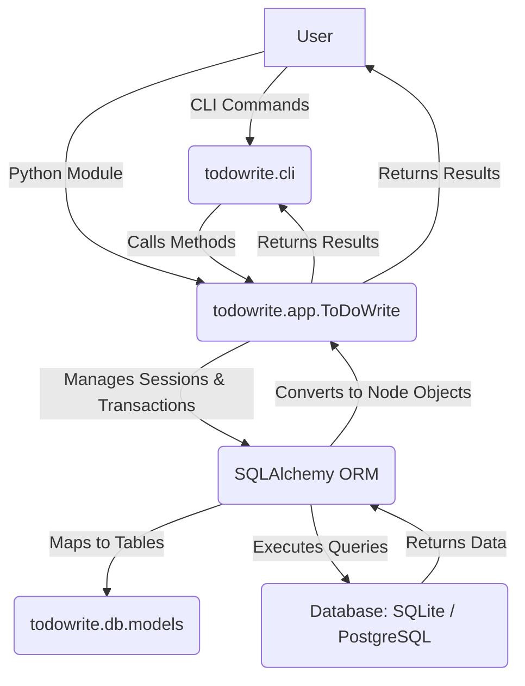

# Architectural Overview

ToDoWrite is designed as a hierarchical task management system with a clear separation of concerns, leveraging modern Python features and robust database management. The architecture is centered around a flexible data model and a database-agnostic application layer, making it suitable for various deployment scenarios from local development with SQLite to production environments with PostgreSQL.

## Core Components

The system is composed of the following key components:

1.  **Application Layer (`todowrite.app.ToDoWrite`)**:
    *   This is the central class that orchestrates all operations within the ToDoWrite system.
    *   It provides a high-level API for creating, retrieving, updating, and deleting nodes, as well as convenience methods for adding specific types of hierarchical nodes (e.g., `add_goal`, `add_phase`).
    *   It manages database sessions and interactions, abstracting the underlying database details from the user.

2.  **Database Abstraction Layer (DAL) (`todowrite.db.models`, SQLAlchemy)**:
    *   **SQLAlchemy ORM**: ToDoWrite utilizes SQLAlchemy as its Object-Relational Mapper (ORM). This allows Python objects (our `Node`, `Link`, `Metadata`, `Command` data structures) to be mapped to database tables, providing a Pythonic way to interact with the database.
    *   **ORM Models (`todowrite.db.models`)**: The `Base` class and all SQLAlchemy models (`Node`, `Link`, `Label`, `Command`, `Artifact`) are defined here. These models represent the schema of the database tables and define relationships between them (e.g., one-to-many, many-to-many).
    *   **Database Agnostic**: By using SQLAlchemy, the application layer remains largely unaware of the specific database system (SQLite, PostgreSQL, etc.) being used. The choice of database is configured via a connection string.

3.  **Command-Line Interface (CLI) (`todowrite.cli`)**:
    *   Built using the `Click` library, the CLI provides a user-friendly interface for interacting with the ToDoWrite application from the terminal.
    *   It exposes core functionalities like initializing the database, creating nodes, retrieving node details, and listing all nodes.
    *   The CLI acts as a thin wrapper around the `ToDoWrite` application layer.

4.  **Configuration System (`todowrite.db.config`)**:
    *   Manages database connection settings, primarily through the `DATABASE_URL` environment variable.
    *   This allows for easy switching between different database backends (e.g., SQLite for development, PostgreSQL for production) without modifying application code.

## Data Flow and Interactions

The interaction within ToDoWrite follows a clear pattern:

*   **User Interaction**: Users interact with the system either through the CLI (`todowrite` commands) or by importing the `ToDoWrite` class as a Python module.
*   **Application Layer**: User requests are routed to the `ToDoWrite` class. This class validates input, constructs appropriate data structures, and initiates database operations.
*   **Database Abstraction**: The `ToDoWrite` class uses SQLAlchemy's session management to perform CRUD (Create, Read, Update, Delete) operations. It translates Python object operations into SQL queries, which are then executed against the configured database.
*   **Database**: The actual data storage and retrieval are handled by the database system (SQLite or PostgreSQL).
*   **Data Conversion**: Raw data retrieved from the database (SQLAlchemy ORM objects) is converted into user-friendly `Node` dataclass objects before being returned to the application layer or the user.



## Database Agnosticism

A core principle of ToDoWrite's architecture is its database agnosticism. This is primarily achieved through:

*   **SQLAlchemy**: The ORM handles the translation of Python code into dialect-specific SQL. This means the application code does not need to change whether it's connecting to SQLite or PostgreSQL.
*   **`db_url` Configuration**: The choice of database is determined solely by the `db_url` provided during `ToDoWrite` initialization or via the `TODOWRITE_DATABASE_URL` environment variable. This allows for flexible deployment and testing.

## Project Structure

```
todowrite/
├── __init__.py              # Package initialization, exposes ToDoWrite class
├── app.py                   # Core ToDoWrite application class and data structures
├── cli.py                   # Command-Line Interface implementation
├── db/
│   ├── __init__.py         # Database package
│   ├── config.py           # Database configuration (e.g., DATABASE_URL)
│   └── models.py           # SQLAlchemy ORM models (Node, Link, Label, Command, Artifact)
├── __main__.py              # Module execution entry point (calls cli)
```
