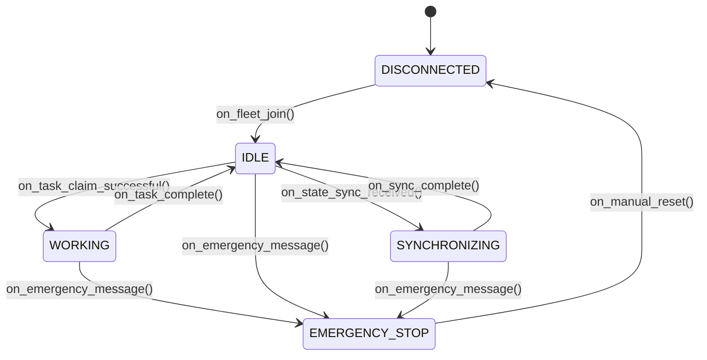

# Fleet Coordination Protocol Specification

**Document Version**: 1.0
**Status**: Proposed
**Date**: 2025-10-04

> **Navigation**: [📚 DOCS Index](../../README.md) | [🏠 Project Root](../../../) | [⚙️ Technical Architecture](../technical/)

---

## 1. Overview

This document specifies the protocol for advanced, decentralized fleet coordination among autonomous agricultural equipment on the AFS FastAPI platform. The protocol enables multi-tractor task orchestration, status synchronization, and emergency coordination, building upon the foundational primitives of `FieldAllocationCRDT`, `VectorClock`, and `ReliableISOBUS`.

The central component implementing this protocol is the `FleetCoordinationEngine`.

## 2. Core Principles

- **Decentralization**: No single point of failure. Tractors coordinate as peers.
- **Eventual Consistency**: All tractors converge to a consistent shared state, leveraging CRDTs.
- **Causal Ordering**: Operations are ordered correctly using Vector Clocks, even with network partitions.
- **Safety and Reliability**: Emergency messages are prioritized and guaranteed via the `ReliableISOBUS` layer.
- **ISOBUS Compliance**: Message payloads are designed to be compact and compatible with ISO 11783 constraints.

---

## 3. Tractor State Machine

Each tractor participating in the fleet operates according to the following state machine:



- **DISCONNECTED**: The tractor is not part of the fleet.
- **IDLE**: The tractor is connected, broadcasting heartbeats, and ready for tasks.
- **SYNCHRONIZING**: The tractor is merging its local state with fleet state received from peers.
- **WORKING**: The tractor has claimed a field section and is actively performing a task.
- **EMERGENCY_STOP**: The tractor has received a fleet-wide emergency stop command and has ceased all motion and operations.

---

## 4. Protocol Messages

All messages share a common header format. Payloads are message-specific.

### 4.1. Message Header

```json
{
  "msg_type": "string",
  "sender_id": "string",
  "vector_clock": {
    "tractor_001": 1,
    "tractor_002": 3
  }
}
```

### 4.2. Message Types

#### `HEARTBEAT` (Low Priority)
- **Purpose**: Announce presence and share basic status. Used for **Fleet-Wide Status Synchronization**.
- **Payload**:
  ```json
  {
    "status": "IDLE" | "WORKING",
    "position": { "lat": float, "lon": float },
    "speed": float,
    "health_metric": float // 0.0 (failed) to 1.0 (healthy)
  }
  ```

#### `STATE_SYNC_REQUEST` (Medium Priority)
- **Purpose**: A newly joined tractor requests the current state from the fleet.
- **Payload**: `{}`

#### `STATE_SYNC_RESPONSE` (Medium Priority)
- **Purpose**: A tractor responds to a sync request by broadcasting its `FieldAllocationCRDT` state. Used for **Fleet-Wide Status Synchronization**.
- **Payload**:
  ```json
  {
    "crdt_payload": "Serialized FieldAllocationCRDT object"
  }
  ```

#### `TASK_CLAIM` (Medium Priority)
- **Purpose**: A tractor claims a field section to begin work. This is an update to the shared CRDT. Used for **Multi-Tractor Task Orchestration**.
- **Payload**:
  ```json
  {
    "section_id": "string",
    "action": "claim" | "release"
  }
  ```

#### `EMERGENCY_STOP` (Highest Priority - Guaranteed Delivery)
- **Purpose**: Immediately halt all fleet operations. Used for **Emergency Coordination Systems**.
- **Payload**:
  ```json
  {
    "reason_code": "OBSTACLE_DETECTED" | "OPERATOR_INTERVENTION" | "SYSTEM_FAULT",
    "source_position": { "lat": float, "lon": float }
  }
  ```

#### `LEADER_ELECTION_VOTE` (High Priority)
- **Purpose**: Participate in electing a leader for a specific task. Used for **Advanced Communication Patterns**.
- **Payload**:
  ```json
  {
    "election_id": "string",
    "candidate_id": "string"
  }
  ```

---

## 5. `FleetCoordinationEngine` API

The `FleetCoordinationEngine` service will expose the following high-level API to the tractor's main application logic.

```python
class FleetCoordinationEngine:
    """Orchestrates fleet coordination using the specified protocol."""

    def __init__(self, tractor_id: str, isobus_interface: ReliableISOBUS):
        """Initializes the engine."""
        # ...

    # --- Lifecycle Methods ---
    async def start(self):
        """Starts the engine and joins the fleet network."""
        # ...

    async def stop(self):
        """Stops the engine and gracefully leaves the fleet."""
        # ...

    # --- Task Orchestration Methods ---
    async def claim_section(self, section_id: str) -> bool:
        """
        Attempt to claim a field section.

        Broadcasts a TASK_CLAIM message and updates the local CRDT.
        Returns True if the claim is successful locally.
        """
        # ...

    async def release_section(self, section_id: str):
        """
        Release a completed field section.

        Broadcasts a TASK_CLAIM message with 'release' action.
        """
        # ...

    # --- Emergency Methods ---
    async def broadcast_emergency_stop(self, reason_code: str):
        """
        Broadcasts a fleet-wide EMERGENCY_STOP message.

        Uses the highest priority channel on the ReliableISOBUS interface.
        """
        # ...

    # --- Status and Query Methods ---
    def get_fleet_status(self) -> dict[str, dict]:
        """Returns the last known status of all tractors in the fleet."""
        # ...

    def get_field_allocation_state(self) -> FieldAllocationCRDT:
        """Returns the current, merged view of the field allocation CRDT."""
        # ...

    def get_current_state(self) -> str:
        """Returns the tractor's current state from the state machine."""
        # ...

    # --- Event Subscription ---
    def on_state_change(self, callback: Callable[[str], None]):
        """Register a callback for state machine transitions."""
        # ...

    def on_emergency(self, callback: Callable[[dict], None]):
        """Register a callback for when an EMERGENCY_STOP is received."""
        # ...
```

---

## 6. Conclusion

This protocol provides a robust, decentralized, and safe framework for multi-tractor coordination. By composing our existing, well-tested primitives, the `FleetCoordinationEngine` will deliver the advanced capabilities required for next-generation autonomous farming, fully compliant with ISO 11783 and ISO 18497 standards. The next step is to implement this design, starting with the RED phase of TDD.